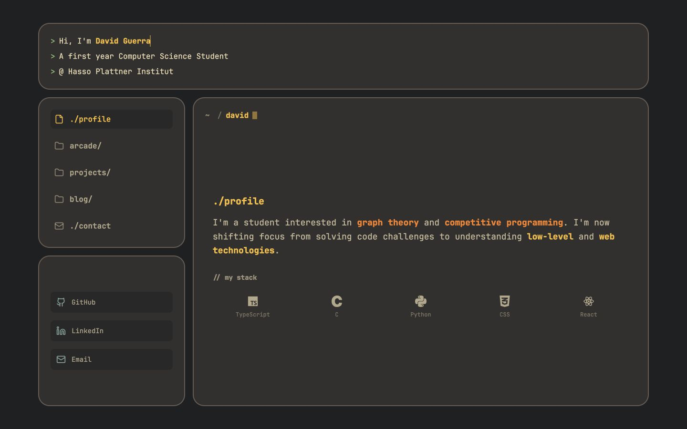
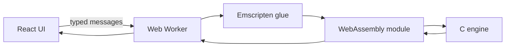

# David Guerra — Portfolio

A Gruvbox-inspired portfolio featuring interactive browser games backed by C engines compiled to WebAssembly and kept off the main thread with Web Workers.

[View the live portfolio](https://david-guerra.github.io/portfolio/)



## Architecture



Each game owns a worker and a small message protocol. Connect 4 runs a bitboard negamax search with alpha-beta pruning; Sudoku uses constraint masks and backtracking; Game of Life uses a double-buffered grid.

## Run locally

Requirements: Node.js 20 or newer and npm.

```bash
npm ci
npm run dev
```

The Vite app is served under `/portfolio/` to match GitHub Pages.

## Quality checks

```bash
npm run test:phase0
npm run lint
npm run build
```

The current Connect 4 native test can be rebuilt without writing a binary into the repository:

```bash
clang c_connect/test_connect.c c_connect/boardcontrol.c c_connect/gamecontrol.c -o /tmp/test_connect && /tmp/test_connect
```

## Rebuild the WASM engines

Install [Emscripten](https://emscripten.org/docs/getting_started/downloads.html), then run these commands from the repository root:

```bash
emcc c_connect/wasm_adapter.c c_connect/boardcontrol.c c_connect/gamecontrol.c c_connect/botcontrol.c -O3 --no-entry -sWASM=1 -sMODULARIZE=1 -sEXPORT_NAME=createGameBotModule -sENVIRONMENT=worker -sEXPORTED_RUNTIME_METHODS='["ccall","cwrap"]' -o public/wasm/game_bot.js
emcc c_sudoku/wasm_adapter.c c_sudoku/boardcontrol.c -O3 --no-entry -sWASM=1 -sMODULARIZE=1 -sEXPORT_NAME=createSudokuModule -sENVIRONMENT=worker -sEXPORTED_RUNTIME_METHODS='["ccall","cwrap"]' -o public/wasm/sudoku.js
emcc c_lifegame/wasm_adapter.c c_lifegame/boardcontrol.c -O3 --no-entry -sWASM=1 -sMODULARIZE=1 -sEXPORT_NAME=createGoLModule -sENVIRONMENT=worker -sEXPORTED_RUNTIME_METHODS='["ccall","cwrap"]' -o public/wasm/game_of_life.js
```

## Deployment

Pushes to `main` are built and deployed by `.github/workflows/deploy.yml`. Add a repository Actions secret named `WEB3FORMS_ACCESS_KEY` before relying on the contact form in production.

JetBrains Mono is redistributed under the SIL Open Font License in `public/fonts/OFL.txt`.
