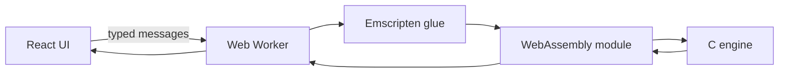

# David Guerra — Portfolio

A responsive portfolio built around a pixel-canvas identity, project galleries,
and three playable browser games backed by C engines compiled to WebAssembly.
The game engines stay off the main thread in Web Workers.

[View the live site](https://david-guerra.github.io/portfolio/).

## Architecture



Each game owns a worker and a small message protocol. Connect 4 runs a bitboard
negamax search with alpha-beta pruning; Sudoku uses constraint masks and
backtracking; Game of Life uses a double-buffered grid.

Toolchain: Vite 8, React 19, TypeScript 6, Tailwind 4, ESLint 10.

## Run locally

Requirements: Node.js 24 (see `.nvmrc`; anything ≥ 22.22 works) and npm.

```bash
npm ci
npm run dev
```

The Vite app is served under `/portfolio/` to match GitHub Pages.

## Quality checks

```bash
npm run lint
npm run typecheck
npm test
npm run build
npm run check:budget
```

`npm test` drives the three real workers against the shipped `.wasm` engines
under Node's test runner (see `tests/helpers/worker-harness.ts`).

The launch budget caps the application entry bundle at 100 KiB gzip for
JavaScript and 16 KiB gzip for CSS. CI checks both limits after every build.

## Launch posture

- No analytics or tracking. The shipped page makes no external requests.
- A restrictive meta CSP allows only the same-origin assets and WebAssembly
  workers the portfolio needs.
- Retired hash routes redirect into the current About, Projects, Arcade, and
  contact surfaces.

The Connect 4 native test can be rebuilt without writing a binary into the
repository:

```bash
clang c_connect/test_connect.c c_connect/boardcontrol.c c_connect/gamecontrol.c -o /tmp/test_connect && /tmp/test_connect
```

## Rebuild the WASM engines

Install [Emscripten](https://emscripten.org/docs/getting_started/downloads.html), then run these commands from the repository root:

```bash
emcc c_connect/wasm_adapter.c c_connect/boardcontrol.c c_connect/gamecontrol.c c_connect/botcontrol.c -O3 --no-entry -sWASM=1 -sMODULARIZE=1 -sEXPORT_NAME=createGameBotModule -sENVIRONMENT=worker -sEXPORTED_RUNTIME_METHODS='["ccall","cwrap"]' -o public/wasm/game_bot.js
emcc c_sudoku/wasm_adapter.c c_sudoku/boardcontrol.c -O3 --no-entry -sWASM=1 -sMODULARIZE=1 -sEXPORT_NAME=createSudokuModule -sENVIRONMENT=worker -sEXPORTED_RUNTIME_METHODS='["ccall","cwrap"]' -o public/wasm/sudoku.js
emcc c_lifegame/wasm_adapter.c c_lifegame/boardcontrol.c -O3 --no-entry -sWASM=1 -sMODULARIZE=1 -sEXPORT_NAME=createGoLModule -sENVIRONMENT=worker -sEXPORTED_RUNTIME_METHODS='["ccall","cwrap"]' -o public/wasm/game_of_life.js
```

## Deployment

Pushes to `main` run lint, typecheck, tests, and the build, then deploy to
GitHub Pages via `.github/workflows/deploy.yml`. Pull requests run the same
checks without deploying.
