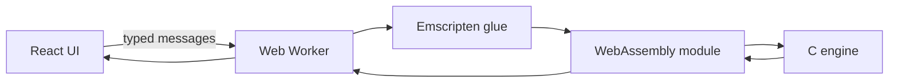

# Phase 0 Portfolio Repair Implementation Plan

> **For agentic workers:** REQUIRED SUB-SKILL: Use superpowers:subagent-driven-development (recommended) or superpowers:executing-plans to implement this plan task-by-task. Steps use checkbox (`- [ ]`) syntax for tracking.

**Goal:** Make the current portfolio safe to share by repairing its broken deployment path, intended presentation, recovery states, repository hygiene, and repository/share entry points without beginning Phase 1 content work.

**Architecture:** Keep the React/Vite/HashRouter application and Gruvbox identity intact. Add small source-contract tests with Node’s built-in test runner, repair each independently testable slice, and finish with real browser captures plus end-to-end build and native-engine checks.

**Tech Stack:** React 18, TypeScript, Vite 5, Tailwind CSS 3, ESLint 8 flat config, Node test runner, GitHub Pages, Emscripten, C, headless Chrome.

## Global Constraints

- Implement only the eight Phase 0 items in `artifacts/portfolio-audit.html`; Phase 1 positioning and content remain out of scope.
- Preserve the Gruvbox terminal identity.
- Use `#1d2021` for the page canvas, `#282828` for the primary inner surface, and `#32302f` for the soft card surface.
- Keep GitHub Pages and `HashRouter` in Phase 0.
- Never commit a Web3Forms key; CI reads repository secret `WEB3FORMS_ACCESS_KEY` into `VITE_WEB3FORMS_ACCESS_KEY`.
- Treat `vite.config.ts` as canonical. The pre-existing generated `vite.config.js` edit already matches its `/portfolio/` base and may be removed with the generated file.
- Do not modify or stage `artifacts/portfolio-audit.html`.
- Use the official JetBrains Mono variable webfont and include its OFL license.

---

### Task 1: Deployment contract for Web3Forms

**Files:**
- Create: `tests/phase0-deployment.test.mjs`
- Modify: `package.json`
- Modify: `.github/workflows/deploy.yml`

**Interfaces:**
- Consumes: GitHub Actions repository secret `WEB3FORMS_ACCESS_KEY`.
- Produces: build-time environment variable `VITE_WEB3FORMS_ACCESS_KEY`; npm command `npm run test:phase0`.

- [ ] **Step 1: Add the source-contract test and test command**

Add this script to `package.json`:

```json
"test:phase0": "node --test tests/phase0-*.test.mjs"
```

Create `tests/phase0-deployment.test.mjs`:

```js
import assert from 'node:assert/strict'
import { readFile } from 'node:fs/promises'
import test from 'node:test'

test('the Pages build receives the Web3Forms repository secret', async () => {
  const workflow = await readFile('.github/workflows/deploy.yml', 'utf8')

  assert.match(
    workflow,
    /VITE_WEB3FORMS_ACCESS_KEY:\s*\$\{\{\s*secrets\.WEB3FORMS_ACCESS_KEY\s*\}\}/,
  )
})
```

- [ ] **Step 2: Run the test and verify the regression is exposed**

Run: `npm run test:phase0`

Expected: FAIL in `phase0-deployment.test.mjs` because the workflow does not contain `VITE_WEB3FORMS_ACCESS_KEY`.

- [ ] **Step 3: Pass the secret to the build**

Extend the existing build step without changing the public social URLs:

```yaml
      - name: Build
        run: npm run build
        env:
          VITE_GITHUB_URL: https://github.com/david-guerra
          VITE_LINKEDIN_URL: https://linkedin.com/in/david-guerrasal
          VITE_WEB3FORMS_ACCESS_KEY: ${{ secrets.WEB3FORMS_ACCESS_KEY }}
```

- [ ] **Step 4: Verify the deployment contract**

Run: `npm run test:phase0`

Expected: one passing test.

- [ ] **Step 5: Commit the deployment repair**

```bash
git add package.json .github/workflows/deploy.yml tests/phase0-deployment.test.mjs
git commit -m "fix: pass contact key to pages build"
```

---

### Task 2: Font, favicon, motion, and Gruvbox depth

**Files:**
- Create: `tests/phase0-presentation.test.mjs`
- Create: `public/favicon.svg`
- Create: `public/fonts/JetBrainsMono-Variable.woff2`
- Create: `public/fonts/OFL.txt`
- Modify: `src/index.css`
- Modify: `tailwind.config.js`
- Modify: `src/features/IntroCard.tsx`
- Modify: `src/layouts/BentoLayout.tsx`

**Interfaces:**
- Consumes: official JetBrains Mono `JetBrainsMono[wght].woff2` and `OFL.txt` from `JetBrains/JetBrainsMono`.
- Produces: local `JetBrains Mono` font face, `animate-typing-effect`, working `animate-fade-in`, a real SVG favicon, and three distinct Gruvbox surface levels.

- [ ] **Step 1: Write the presentation contract test**

Create `tests/phase0-presentation.test.mjs`:

```js
import assert from 'node:assert/strict'
import { readFile } from 'node:fs/promises'
import test from 'node:test'

test('the intended local font and favicon exist', async () => {
  const [font, license, favicon] = await Promise.all([
    readFile('public/fonts/JetBrainsMono-Variable.woff2'),
    readFile('public/fonts/OFL.txt', 'utf8'),
    readFile('public/favicon.svg', 'utf8'),
  ])

  assert.equal(font.subarray(0, 4).toString('ascii'), 'wOF2')
  assert.match(license, /SIL OPEN FONT LICENSE/i)
  assert.match(favicon, /<svg[\s>]/)
  assert.match(favicon, />DG</)
})

test('Gruvbox depth and both missing animations are defined', async () => {
  const [css, tailwind, intro, layout] = await Promise.all([
    readFile('src/index.css', 'utf8'),
    readFile('tailwind.config.js', 'utf8'),
    readFile('src/features/IntroCard.tsx', 'utf8'),
    readFile('src/layouts/BentoLayout.tsx', 'utf8'),
  ])

  assert.match(css, /@font-face/)
  assert.match(css, /JetBrainsMono-Variable\.woff2/)
  assert.match(css, /prefers-reduced-motion:\s*reduce/)
  assert.match(tailwind, /'bg-hard':\s*'#1d2021'/)
  assert.match(tailwind, /'bg-soft':\s*'#32302f'/)
  assert.match(tailwind, /typing:\s*\{/)
  assert.match(tailwind, /fadeIn:\s*\{/)
  assert.match(tailwind, /'typing-effect':/)
  assert.match(tailwind, /'fade-in':/)
  assert.match(intro, /animate-typing-effect/)
  assert.match(layout, /bg-gruv-bg-hard/)
})
```

- [ ] **Step 2: Run the test and verify it fails**

Run: `npm run test:phase0`

Expected: deployment test PASS; presentation tests FAIL because the assets, colors, and keyframes do not exist.

- [ ] **Step 3: Add the licensed font and favicon assets**

Run:

```bash
mkdir -p public/fonts
curl -L 'https://raw.githubusercontent.com/JetBrains/JetBrainsMono/master/fonts/webfonts/JetBrainsMono%5Bwght%5D.woff2' -o public/fonts/JetBrainsMono-Variable.woff2
curl -L 'https://raw.githubusercontent.com/JetBrains/JetBrainsMono/master/OFL.txt' -o public/fonts/OFL.txt
```

Create `public/favicon.svg`:

```svg
<svg xmlns="http://www.w3.org/2000/svg" viewBox="0 0 64 64" role="img" aria-label="David Guerra">
  <rect width="64" height="64" rx="12" fill="#1d2021"/>
  <path d="M10 16h44v32H10z" fill="#282828" stroke="#665c54" stroke-width="3"/>
  <circle cx="17" cy="23" r="2.5" fill="#fb4934"/>
  <circle cx="25" cy="23" r="2.5" fill="#fabd2f"/>
  <circle cx="33" cy="23" r="2.5" fill="#b8bb26"/>
  <text x="32" y="42" fill="#ebdbb2" font-family="ui-monospace, monospace" font-size="17" font-weight="700" text-anchor="middle">DG</text>
</svg>
```

- [ ] **Step 4: Define the local font, motion fallback, palette, and animations**

Replace `src/index.css` with:

```css
@font-face {
  font-family: 'JetBrains Mono';
  src: url('/fonts/JetBrainsMono-Variable.woff2') format('woff2-variations');
  font-style: normal;
  font-weight: 100 800;
  font-display: swap;
}

@tailwind base;
@tailwind components;
@tailwind utilities;

:root {
  font-family: 'JetBrains Mono', ui-monospace, 'SFMono-Regular', Consolas, monospace;
  color-scheme: dark;
}

body {
  min-width: 320px;
  margin: 0;
  background: #1d2021;
}

@media (prefers-reduced-motion: reduce) {
  .animate-typing-effect,
  .animate-fade-in {
    animation: none !important;
  }
}
```

Add these entries under `theme.extend` in `tailwind.config.js`:

```js
colors: {
  gruv: {
    'bg-hard': '#1d2021',
    bg: '#282828',
    'bg-soft': '#32302f',
    fg: '#ebdbb2',
    red: '#fb4934',
    green: '#b8bb26',
    yellow: '#fabd2f',
    blue: '#83a598',
    purple: '#d3869b',
    aqua: '#8ec07c',
    orange: '#fe8019',
  },
},
keyframes: {
  typing: {
    from: { width: '0' },
    to: { width: '12ch' },
  },
  caret: {
    '50%': { borderColor: 'transparent' },
  },
  fadeIn: {
    from: { opacity: '0', transform: 'translateY(0.25rem)' },
    to: { opacity: '1', transform: 'translateY(0)' },
  },
},
animation: {
  'typing-effect': 'typing 1.2s steps(12, end) 0.2s both, caret 0.75s step-end infinite',
  'fade-in': 'fadeIn 0.25s ease-out both',
},
```

Change the name span in `src/features/IntroCard.tsx` to:

```tsx
<span className="inline-block w-[12ch] overflow-hidden whitespace-nowrap border-r border-gruv-yellow align-bottom text-gruv-yellow font-bold animate-typing-effect">
  David Guerra
</span>
```

Change the outer page class in `src/layouts/BentoLayout.tsx` from `bg-gruv-bg` to `bg-gruv-bg-hard`.

- [ ] **Step 5: Verify presentation contracts and production compilation**

Run: `npm run test:phase0 && npm run build`

Expected: three tests PASS; TypeScript and Vite build PASS. Inspect the generated CSS and confirm it references `/portfolio/fonts/JetBrainsMono-Variable.woff2`.

- [ ] **Step 6: Commit the presentation foundations**

```bash
git add public/favicon.svg public/fonts src/index.css tailwind.config.js src/features/IntroCard.tsx src/layouts/BentoLayout.tsx tests/phase0-presentation.test.mjs
git commit -m "fix: restore portfolio visual foundations"
```

---

### Task 3: In-app 404 recovery and Connect 4 retry

**Files:**
- Create: `tests/phase0-recovery.test.mjs`
- Modify: `src/App.tsx`
- Modify: `src/hooks/useGameBot.ts`
- Modify: `src/features/games/connect4/Connect4View.tsx`

**Interfaces:**
- Consumes: `BotResponse` error messages and the existing `HashRouter`.
- Produces: `useGameBot().retry: () => void`; visible `role="alert"` failure UI; router-safe home link.

- [ ] **Step 1: Write recovery source-contract tests**

Create `tests/phase0-recovery.test.mjs`:

```js
import assert from 'node:assert/strict'
import { readFile } from 'node:fs/promises'
import test from 'node:test'

test('the not-found escape route stays inside React Router', async () => {
  const app = await readFile('src/App.tsx', 'utf8')

  assert.match(app, /import\s*\{[^}]*Link[^}]*\}\s*from\s*['"]react-router-dom['"]/s)
  assert.match(app, /<Link\s+to="\/"/)
  assert.doesNotMatch(app, /<a\s+href="\/"/)
})

test('Connect 4 exposes worker failure and retry states', async () => {
  const [hook, view] = await Promise.all([
    readFile('src/hooks/useGameBot.ts', 'utf8'),
    readFile('src/features/games/connect4/Connect4View.tsx', 'utf8'),
  ])

  assert.match(hook, /worker\.onerror\s*=/)
  assert.match(hook, /const retry = useCallback/)
  assert.match(hook, /return\s*\{[^}]*error[^}]*retry[^}]*\}/s)
  assert.match(view, /role="alert"/)
  assert.match(view, /BOT_INIT_FAILED/)
  assert.match(view, /onClick=\{retry\}/)
})
```

- [ ] **Step 2: Run the test and verify both regressions fail**

Run: `npm run test:phase0`

Expected: existing tests PASS; both recovery tests FAIL.

- [ ] **Step 3: Keep 404 navigation inside the hash router**

Update the import and escape link in `src/App.tsx`:

```tsx
import { HashRouter, Routes, Route, Navigate, Link } from 'react-router-dom'
```

```tsx
<Link to="/" className="text-gruv-yellow hover:underline text-sm">
  ← Back to home
</Link>
```

- [ ] **Step 4: Add worker lifecycle retry to `useGameBot`**

Add a generation counter beside the existing state:

```ts
const [workerGeneration, setWorkerGeneration] = useState(0)
```

At the beginning of the worker effect, reset transient startup state:

```ts
setIsReady(false)
setError(null)
```

Replace the `ERROR` response branch with:

```ts
case 'ERROR':
  setIsReady(false)
  setError(msg.payload)
  console.error('Bot Worker Error:', msg.payload)
  break
```

Add a native worker error handler before posting `INIT`:

```ts
worker.onerror = (event) => {
  setIsReady(false)
  setError(event.message || 'The Connect 4 engine failed to start.')
}
```

Make the effect depend on both startup inputs:

```ts
}, [scriptPath, workerGeneration])
```

Add the retry callback:

```ts
const retry = useCallback(() => {
  setError(null)
  setWorkerGeneration((generation) => generation + 1)
}, [])
```

Return it with the existing hook API:

```ts
return { isReady, board, gameStatus, winner, makeMove, computeBotMove, lastBotMove, resetGame, setDifficulty, error, retry }
```

- [ ] **Step 5: Render a useful failure state in Connect 4**

Destructure `error` and `retry` from `useGameBot()`, then make the status area an announced state:

```tsx
<div className="mb-2 text-gruv-fg font-mono" aria-live="polite">
  {error ? (
    <div role="alert" className="flex flex-wrap items-center justify-center gap-3 text-sm text-gruv-red">
      <span>BOT_INIT_FAILED</span>
      <button
        type="button"
        onClick={retry}
        className="rounded border border-gruv-red px-2 py-1 text-xs hover:bg-gruv-red hover:text-gruv-bg-hard transition-colors"
      >
        Retry
      </button>
    </div>
  ) : gameStatus === 'playing' ? (
    <span>TURN: <span className={localTurn === 1 ? 'text-red-500' : 'text-yellow-500'}>{localTurn === 1 ? 'YOU (RED)' : 'BOT (YELLOW)'}</span></span>
  ) : gameStatus === 'won' ? (
    <span className="text-xl font-bold text-gruv-yellow">{winner === 1 ? 'YOU WON!' : 'BOT WINS!'}</span>
  ) : (
    <span>DRAW!</span>
  )}
  {!isReady && !error && <span className="ml-4 text-xs text-gruv-fg/50">(Loading Bot...)</span>}
</div>
```

- [ ] **Step 6: Verify recovery behavior compiles**

Run: `npm run test:phase0 && npm run build`

Expected: five tests PASS; build PASS.

- [ ] **Step 7: Commit recovery behavior**

```bash
git add src/App.tsx src/hooks/useGameBot.ts src/features/games/connect4/Connect4View.tsx tests/phase0-recovery.test.mjs
git commit -m "fix: recover from routing and bot startup errors"
```

---

### Task 4: Tracked-artifact cleanup and working lint gate

**Files:**
- Create: `tests/phase0-hygiene.test.mjs`
- Create: `eslint.config.js`
- Modify: `.gitignore`
- Delete: `vite.config.js`
- Delete: `vite.config.d.ts`
- Delete: `test_life`
- Delete: `c_connect/test_connect`

**Interfaces:**
- Consumes: canonical `vite.config.ts` with base `/portfolio/`.
- Produces: `npm run lint` as a working quality gate; targeted ignore rules that do not hide C sources or Vite source configuration.

- [ ] **Step 1: Write the hygiene regression test**

Create `tests/phase0-hygiene.test.mjs`:

```js
import assert from 'node:assert/strict'
import { execFileSync } from 'node:child_process'
import { readFile } from 'node:fs/promises'
import test from 'node:test'

const generatedPaths = [
  'vite.config.js',
  'vite.config.d.ts',
  'test_life',
  'c_connect/test_connect',
]

test('generated configs and native test binaries are ignored and untracked', async () => {
  const ignore = await readFile('.gitignore', 'utf8')
  const tracked = execFileSync('git', ['ls-files', '--', ...generatedPaths], { encoding: 'utf8' }).trim()

  assert.equal(tracked, '')
  assert.match(ignore, /^\/vite\.config\.js$/m)
  assert.match(ignore, /^\/vite\.config\.d\.ts$/m)
  assert.match(ignore, /^\/test_life$/m)
  assert.match(ignore, /^\/c_connect\/test_connect$/m)
})

test('an ESLint flat configuration exists', async () => {
  const config = await readFile('eslint.config.js', 'utf8')
  assert.match(config, /typescript-eslint\/parser/)
  assert.match(config, /react-hooks/)
  assert.match(config, /react-refresh/)
})
```

- [ ] **Step 2: Verify the hygiene test fails**

Run: `npm run test:phase0`

Expected: existing tests PASS; hygiene tests FAIL because the files are tracked and no flat config exists.

- [ ] **Step 3: Remove generated artifacts and ignore exact replacements**

Verify `vite.config.ts` contains `base: '/portfolio/'`, then run:

```bash
git rm vite.config.js vite.config.d.ts test_life c_connect/test_connect
```

Append these exact rules to `.gitignore`:

```gitignore

# Generated TypeScript config output
/vite.config.js
/vite.config.d.ts

# Native C test executables
/test_life
/c_connect/test_connect
```

- [ ] **Step 4: Add a flat ESLint configuration compatible with the installed versions**

Create `eslint.config.js`:

```js
import tsParser from '@typescript-eslint/parser'
import tsPlugin from '@typescript-eslint/eslint-plugin'
import reactHooks from 'eslint-plugin-react-hooks'
import reactRefresh from 'eslint-plugin-react-refresh'

export default [
  {
    ignores: ['dist/**', 'node_modules/**', 'public/wasm/**'],
  },
  {
    files: ['src/**/*.{ts,tsx}', 'vite.config.ts'],
    languageOptions: {
      parser: tsParser,
      parserOptions: {
        ecmaVersion: 'latest',
        sourceType: 'module',
        ecmaFeatures: { jsx: true },
      },
    },
    plugins: {
      '@typescript-eslint': tsPlugin,
      'react-hooks': reactHooks,
    },
    rules: {
      ...reactHooks.configs.recommended.rules,
      'no-unused-vars': 'off',
      '@typescript-eslint/no-unused-vars': ['error', { argsIgnorePattern: '^_' }],
    },
  },
  {
    files: ['src/**/*.tsx'],
    plugins: {
      'react-refresh': reactRefresh,
    },
    rules: {
      'react-refresh/only-export-components': ['error', { allowConstantExport: true }],
    },
  },
]
```

- [ ] **Step 5: Run all local quality gates**

Run:

```bash
npm run test:phase0
npm run lint
npm run build
```

Expected: seven tests PASS; lint exits 0 with no warnings; build exits 0.

- [ ] **Step 6: Commit repository hygiene**

```bash
git add .gitignore eslint.config.js tests/phase0-hygiene.test.mjs
git add -u vite.config.js vite.config.d.ts test_life c_connect/test_connect
git commit -m "chore: restore linting and remove generated files"
```

---

### Task 5: Metadata, preview images, and repository front door

**Files:**
- Create: `tests/phase0-entrypoints.test.mjs`
- Create: `public/og-image.png`
- Create: `public/portfolio-preview.png`
- Create: `README.md`
- Modify: `index.html`

**Interfaces:**
- Consumes: the repaired landing page at `/portfolio/` and static assets from Tasks 2–4.
- Produces: favicon/font preload and social metadata in `index.html`; a 1200×630 Open Graph image; a repository screenshot; a verified README.

- [ ] **Step 1: Write the entry-point contract test**

Create `tests/phase0-entrypoints.test.mjs`:

```js
import assert from 'node:assert/strict'
import { readFile } from 'node:fs/promises'
import test from 'node:test'

function pngDimensions(buffer) {
  assert.equal(buffer.subarray(1, 4).toString('ascii'), 'PNG')
  return {
    width: buffer.readUInt32BE(16),
    height: buffer.readUInt32BE(20),
  }
}

test('document metadata and base-aware assets are complete', async () => {
  const html = await readFile('index.html', 'utf8')

  assert.match(html, /%BASE_URL%favicon\.svg/)
  assert.match(html, /%BASE_URL%fonts\/JetBrainsMono-Variable\.woff2/)
  assert.match(html, /<title>David Guerra \| Software Builder<\/title>/)
  assert.match(html, /name="description"/)
  assert.match(html, /property="og:image"/)
  assert.match(html, /name="twitter:card" content="summary_large_image"/)
})

test('sharing and README images have intentional dimensions', async () => {
  const [og, preview] = await Promise.all([
    readFile('public/og-image.png'),
    readFile('public/portfolio-preview.png'),
  ])

  assert.deepEqual(pngDimensions(og), { width: 1200, height: 630 })
  assert.deepEqual(pngDimensions(preview), { width: 1440, height: 900 })
})

test('README explains the live project, architecture, and both build paths', async () => {
  const readme = await readFile('README.md', 'utf8')

  assert.match(readme, /https:\/\/david-guerra\.github\.io\/portfolio\//)
  assert.match(readme, /```mermaid/)
  assert.match(readme, /npm ci/)
  assert.match(readme, /npm run dev/)
  assert.match(readme, /emcc c_connect\/wasm_adapter\.c/)
  assert.match(readme, /WEB3FORMS_ACCESS_KEY/)
})
```

- [ ] **Step 2: Run the test and verify missing entry points fail**

Run: `npm run test:phase0`

Expected: earlier tests PASS; all three entry-point tests FAIL.

- [ ] **Step 3: Replace the minimal document head with complete metadata**

Use this head in `index.html`:

```html
<head>
  <meta charset="UTF-8" />
  <meta name="viewport" content="width=device-width, initial-scale=1.0" />
  <link rel="icon" type="image/svg+xml" href="%BASE_URL%favicon.svg" />
  <link rel="preload" href="%BASE_URL%fonts/JetBrainsMono-Variable.woff2" as="font" type="font/woff2" crossorigin />
  <title>David Guerra | Software Builder</title>
  <meta name="description" content="David Guerra builds systems-heavy web projects with TypeScript, React, C, WebAssembly, and Web Workers." />
  <meta property="og:type" content="website" />
  <meta property="og:url" content="https://david-guerra.github.io/portfolio/" />
  <meta property="og:title" content="David Guerra | Software Builder" />
  <meta property="og:description" content="Systems-heavy web projects built with TypeScript, React, C, WebAssembly, and Web Workers." />
  <meta property="og:image" content="https://david-guerra.github.io/portfolio/og-image.png" />
  <meta property="og:image:width" content="1200" />
  <meta property="og:image:height" content="630" />
  <meta property="og:image:alt" content="David Guerra’s Gruvbox terminal portfolio" />
  <meta name="twitter:card" content="summary_large_image" />
  <meta name="twitter:title" content="David Guerra | Software Builder" />
  <meta name="twitter:description" content="Systems-heavy web projects built with TypeScript, React, C, WebAssembly, and Web Workers." />
  <meta name="twitter:image" content="https://david-guerra.github.io/portfolio/og-image.png" />
</head>
```

- [ ] **Step 4: Create the README with verified project facts**

Create `README.md` with this structure and copy:

````md
# David Guerra — Portfolio

A Gruvbox-inspired portfolio featuring interactive browser games backed by C engines compiled to WebAssembly and kept off the main thread with Web Workers.

[View the live portfolio](https://david-guerra.github.io/portfolio/)


## Architecture



Each game owns a worker and a small message protocol. Connect 4 runs a bitboard negamax search with alpha-beta pruning; Sudoku uses constraint masks and backtracking; Game of Life uses a double-buffered grid.

## Run locally

Requirements: Node.js 20 or newer and npm.

```bash
npm ci
npm run dev
```

The Vite app is served under `/portfolio/` to match GitHub Pages.

## Quality checks

```bash
npm run test:phase0
npm run lint
npm run build
```

The current Connect 4 native test can be rebuilt without writing a binary into the repository:

```bash
clang c_connect/test_connect.c c_connect/boardcontrol.c c_connect/gamecontrol.c -o /tmp/test_connect && /tmp/test_connect
```

## Rebuild the WASM engines

Install [Emscripten](https://emscripten.org/docs/getting_started/downloads.html), then run these commands from the repository root:

```bash
emcc c_connect/wasm_adapter.c c_connect/boardcontrol.c c_connect/gamecontrol.c c_connect/botcontrol.c -O3 --no-entry -sWASM=1 -sMODULARIZE=1 -sEXPORT_NAME=createGameBotModule -sENVIRONMENT=worker -sEXPORTED_RUNTIME_METHODS='["ccall","cwrap"]' -o public/wasm/game_bot.js
emcc c_sudoku/wasm_adapter.c c_sudoku/boardcontrol.c -O3 --no-entry -sWASM=1 -sMODULARIZE=1 -sEXPORT_NAME=createSudokuModule -sENVIRONMENT=worker -sEXPORTED_RUNTIME_METHODS='["ccall","cwrap"]' -o public/wasm/sudoku.js
emcc c_lifegame/wasm_adapter.c c_lifegame/boardcontrol.c -O3 --no-entry -sWASM=1 -sMODULARIZE=1 -sEXPORT_NAME=createGoLModule -sENVIRONMENT=worker -sEXPORTED_RUNTIME_METHODS='["ccall","cwrap"]' -o public/wasm/game_of_life.js
```

## Deployment

Pushes to `main` are built and deployed by `.github/workflows/deploy.yml`. Add a repository Actions secret named `WEB3FORMS_ACCESS_KEY` before relying on the contact form in production.

JetBrains Mono is redistributed under the SIL Open Font License in `public/fonts/OFL.txt`.
````

- [ ] **Step 5: Capture deterministic browser assets from the repaired landing page**

Start Vite in a persistent terminal:

```bash
npm run dev -- --host 127.0.0.1
```

After the server reports its URL, run:

```bash
'/Applications/Google Chrome.app/Contents/MacOS/Google Chrome' --headless=new --hide-scrollbars --force-device-scale-factor=1 --virtual-time-budget=2500 --window-size=1200,630 --screenshot=public/og-image.png http://127.0.0.1:5173/portfolio/
'/Applications/Google Chrome.app/Contents/MacOS/Google Chrome' --headless=new --hide-scrollbars --force-device-scale-factor=1 --virtual-time-budget=2500 --window-size=1440,900 --screenshot=public/portfolio-preview.png http://127.0.0.1:5173/portfolio/
```

Expected: Chrome writes exact-size PNGs and the captures show the repaired font, card depth, and completed typing effect.

- [ ] **Step 6: Verify entry points and production asset paths**

Run:

```bash
npm run test:phase0
npm run build
```

Expected: ten tests PASS and build PASS. Confirm `dist/index.html` contains `/portfolio/favicon.svg`, `/portfolio/fonts/JetBrainsMono-Variable.woff2`, and the absolute Open Graph image URL.

- [ ] **Step 7: Commit the repository and sharing entry points**

```bash
git add README.md index.html public/og-image.png public/portfolio-preview.png tests/phase0-entrypoints.test.mjs
git commit -m "docs: add portfolio entry points and previews"
```

---

### Task 6: Full-story verification

**Files:**
- Verify only; modify the owning task’s files if a check exposes a regression.

**Interfaces:**
- Consumes: all Phase 0 deliverables.
- Produces: fresh evidence that the share, build, routing, engine, and responsive UI stories work together.

- [ ] **Step 1: Run every automated quality gate from a clean process**

```bash
npm run test:phase0
npm run lint
npm run build
clang c_connect/test_connect.c c_connect/boardcontrol.c c_connect/gamecontrol.c -o /tmp/portfolio-test-connect
/tmp/portfolio-test-connect
```

Expected: ten Node tests PASS, lint exits 0, production build exits 0, and Connect 4 prints `All tests PASSED!`. The stale `c_lifegame/test_life.c` API mismatch remains outside Phase 0 rather than being represented as a passing gate.

- [ ] **Step 2: Verify README WASM commands without overwriting committed artifacts**

Run the verified commands against temporary outputs:

```bash
mkdir -p /tmp/portfolio-wasm /tmp/portfolio-emcache
env EM_CACHE=/tmp/portfolio-emcache emcc c_connect/wasm_adapter.c c_connect/boardcontrol.c c_connect/gamecontrol.c c_connect/botcontrol.c -O3 --no-entry -sWASM=1 -sMODULARIZE=1 -sEXPORT_NAME=createGameBotModule -sENVIRONMENT=worker -sEXPORTED_RUNTIME_METHODS='["ccall","cwrap"]' -o /tmp/portfolio-wasm/game_bot.js
env EM_CACHE=/tmp/portfolio-emcache emcc c_sudoku/wasm_adapter.c c_sudoku/boardcontrol.c -O3 --no-entry -sWASM=1 -sMODULARIZE=1 -sEXPORT_NAME=createSudokuModule -sENVIRONMENT=worker -sEXPORTED_RUNTIME_METHODS='["ccall","cwrap"]' -o /tmp/portfolio-wasm/sudoku.js
env EM_CACHE=/tmp/portfolio-emcache emcc c_lifegame/wasm_adapter.c c_lifegame/boardcontrol.c -O3 --no-entry -sWASM=1 -sMODULARIZE=1 -sEXPORT_NAME=createGoLModule -sENVIRONMENT=worker -sEXPORTED_RUNTIME_METHODS='["ccall","cwrap"]' -o /tmp/portfolio-wasm/game_of_life.js
rg -l 'createGameBotModule' /tmp/portfolio-wasm/game_bot.js
rg -l 'createSudokuModule' /tmp/portfolio-wasm/sudoku.js
rg -l 'createGoLModule' /tmp/portfolio-wasm/game_of_life.js
```

Expected: Emscripten produces three `.js` and three `.wasm` files; each JavaScript file names the factory expected by its worker (`createGameBotModule`, `createSudokuModule`, `createGoLModule`).

- [ ] **Step 3: Perform browser QA through the in-app browser**

With Vite running, verify:

- desktop 1440×900 and mobile 390×844 landing layouts have distinct page/card/inner surfaces and no unintended double scroll;
- computed body font is `JetBrains Mono` and the font request returns 200;
- favicon, metadata, and static preview image requests return 200;
- `/#/does-not-exist` shows the themed 404 and “Back to home” returns to `/#/`;
- `/#/arcade` can launch Connect 4 and its worker/WASM requests return 200;
- forcing the Connect 4 WASM request to fail yields `BOT_INIT_FAILED`, and restoring the request then pressing Retry initializes the board;
- no new console errors appear on the landing, 404, contact, or Connect 4 routes.

- [ ] **Step 4: Review repository state and Phase 0 coverage**

Run:

```bash
git status --short
git diff --check
git ls-files vite.config.js vite.config.d.ts test_life c_connect/test_connect
```

Expected: the generated-file query prints nothing; `git diff --check` prints nothing; `artifacts/portfolio-audit.html` is not staged or modified. Any remaining working-tree entry must be named explicitly in the handoff.
